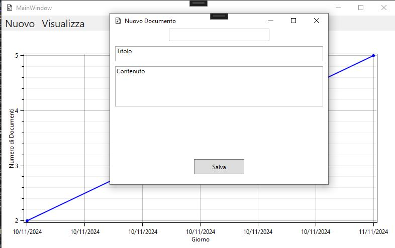

# WPF_NotesApp
Esempio di app Desktop in wpf per inserire note/documenti.
Si possono inserire, modificare, eliminare, i documenti che hanno : categoria, titolo e contenuto. Ottimo come spunto per app
di gestione note, liste e documenti di qualsiasi genere,
Il menu principale possiede un grafico di abbellimento a scopo didattico con OxyPlot, che rappresenta il numero di documenti per giorno di inserimento.

Vengono mostrati solo i file principali del progetto
