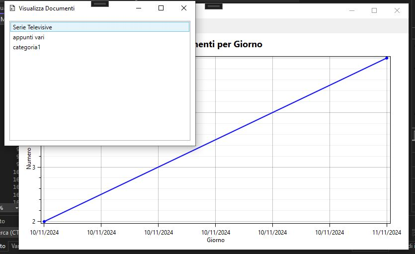
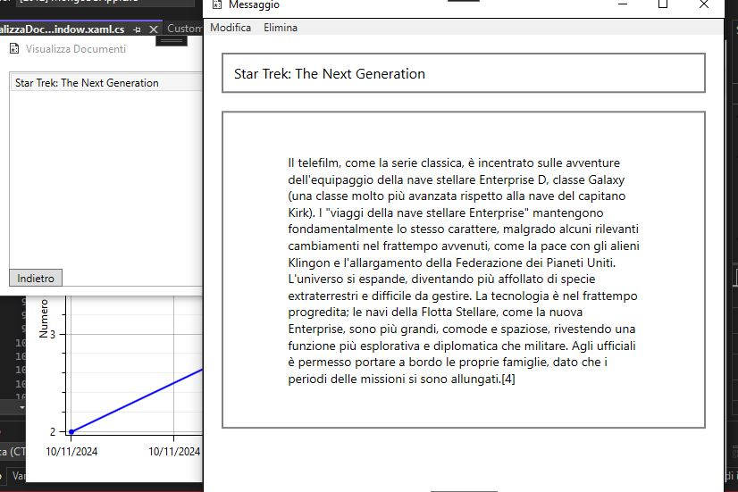

# WPF_NotesApp
Esempio di app Desktop in wpf per inserire note/documenti.
Si possono inserire, modificare, eliminare, i documenti che hanno : categoria, titolo e contenuto. Ottimo come spunto per app
di gestione note, liste e documenti di qualsiasi genere.
Il menu principale possiede un grafico di abbellimento a scopo didattico con OxyPlot, che rappresenta il numero di documenti per giorno di inserimento.

### Finestra di inserimento.
Il box della categoria è un campo suggerito, quindi scrivendo i primi caratteri, appare una lista a cascata con le categorie già presenti che iniziano con i caratteri digitati.

### Finestra categoria dove si può selezionare e visualizzare un documento

Vengono mostrati solo i file principali del progetto
